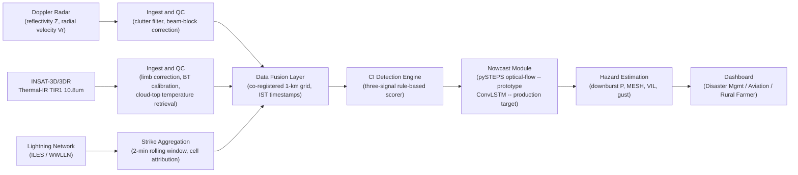
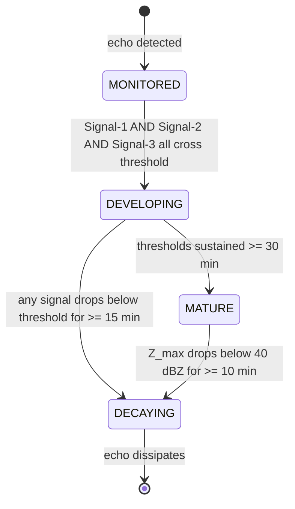

# MeghDrishti

**SIH Problem Statement SIH26084 -- Ministry of Earth Sciences**

India's convective weather -- pre-monsoon squall lines, mesoscale convective systems, embedded thunderstorms during active monsoon -- kills more people per year than any other natural hazard category in the country. The warning window is measured in minutes, not hours. IMD's operational nowcast products are issued at district granularity with 1-hour validity; that resolution is structurally inadequate for issuing aviation holds, redirecting rural emergency response, or triggering block-level alerts before a microburst makes landfall on a densely populated urban area.

MeghDrishti is a decision-support prototype that fuses three independent observational streams -- Doppler weather radar (reflectivity + radial velocity), INSAT-3D/3DR satellite thermal-IR brightness temperature, and surface lightning sensor networks -- into a unified convective-initiation (CI) scoring and short-range hazard nowcast, delivered through a stakeholder-segmented dashboard. The design targets 1-3 km spatial resolution and a 0-6 hour forecast horizon. That horizon is beyond what optical-flow extrapolation handles cleanly; the production architecture requires a data-driven approach that can model storm growth and decay, not just advection.

---

## Data-Fusion Pipeline



---

## What is Actually Running vs. What is Designed

This is a hackathon prototype built over weeks, not an operational system. The distinction matters when evaluating the architecture.

### What runs now

| Component | Implementation |
|---|---|
| CI detection | Three-signal rule-based scorer with fixed thresholds |
| Radar data | Static scenario JSON derived from real IMD radar case studies -- no live radar ingestion |
| Satellite data | Cloud-top temperature values are scenario-embedded constants, not live MOSDAC pulls |
| Lightning | Per-cell `lightningStrikesPerMin` values are scenario constants, not ILES/WWLLN stream |
| Nowcast | Path extrapolation using pre-computed `pastPath` + `forecastCone` vectors -- not pySTEPS |
| Hazard scores | Computed from scenario fields: `vilKgM2`, `meshMm`, `downburstProbPercent`, `gustSpeedKmh` |
| Dashboard | React + Leaflet SPA with animated time-machine slider over scenario state snapshots |

### What the production design requires

| Component | Target |
|---|---|
| Radar ingestion | HDF5/BUFR reader from IMD's 51 operational DWR stations (S/C/X-band); TDWR for 4 metro airports |
| Satellite ingestion | MOSDAC RAPID API (NRT, ~15-min cadence) for INSAT-3D TIR1 10.8um + WV channel |
| Lightning | ILES (IMD Lightning Emission and Detection Sensor) + WWLLN network feed |
| Nowcast | ConvLSTM encoder-decoder trained on 5+ years of IMD composites, with pySTEPS ensemble fallback |
| CI detection | ML-scored probability replacing rule-based fixed thresholds |
| Hazard heads | Separate output heads: downburst probability, MESH hail size, maximum gust, flood-runoff index |
| Latency | End-to-end: ingestion to fusion to nowcast to dashboard update in under 5 minutes |

The reason optical-flow extrapolation alone is insufficient: pySTEPS advects existing features forward -- it has no mechanism to model storm initiation, intensity change, or dissipation. For 0-2 hour lead times on slowly-evolving stratiform systems it performs acceptably. For convective cells with lifecycle timescales of 20-40 minutes, a model that can learn growth/decay dynamics (ConvLSTM or equivalent) is necessary.

---

## Radar Network Context

IMD operated 15 Doppler Weather Radars in 2013. By 2023 that count reached 37, covering roughly 55% of India's landmass. Under Mission Mausam, the MoES roadmap targets 73 stations by FY2025-26 and 126 by 2026-27; as of September 2026 there are 51 operational units. At 37 stations, coverage gaps over the central peninsula, northeastern hill states, and the western Indo-Gangetic Plain were large enough that CI events in those gaps had no radar signature until a storm was already mature. The expansion to 126 dual-polarization stations is the enabling condition for a national convective nowcast system -- not an optional enhancement.

The prototype uses only the NCR (Palam C-band, 28.5N 77.1E) and Kerala (Thiruvananthapuram S-band) scenario cases because those have the most complete publicly available case-study data.

---

## Convective Initiation Detection -- Three-Signal Logic

CI scoring combines three observational signals. All three must exceed threshold simultaneously for a cell to be classified as `DEVELOPING`; sustained exceedance over 30 minutes triggers `MATURE`.



**Signal 1 -- Cloud-top cooling rate (satellite)**
Threshold: brightness temperature decrease >= 6 K in any 15-minute interval (dBT/dt <= -6 K/15min).
Indicates rapid updraft penetrating into the upper troposphere.
Scenario reference: CELL-DL-01 `ciCoolingRateK15m = -6.4` (threshold crossed); CELL-DL-02 = -5.1 (not crossed).

**Signal 2 -- Echo top height (radar)**
Threshold: >= 12 km above MSL for pre-monsoon continental cases; >= 10 km for monsoon-season maritime/coastal cases.
Indicates updraft extending above the freezing level into the mixed-phase zone where hail and strong downdrafts form.
Scenario reference: CELL-DL-01 `echoTopKm = 16.2`; freezing level 4800 m.

**Signal 3 -- Lightning jump (surface sensors)**
Threshold: rate-of-change dF/dt > 2 standard deviations above 20-minute running mean, or absolute rate > 10 strikes/min.
An abrupt increase in total lightning (IC + CG) precedes the peak updraft by 5-20 minutes and is the fastest-responding of the three signals.
Scenario reference: CELL-DL-01 `lightningStrikesPerMin = 48`; CELL-DL-02 = 26.

---

## Hazard Physics

<details>
<summary>Formulas used in hazard estimation (click to expand)</summary>

**Z-R Relation (Marshall-Palmer)**

The standard relation between radar reflectivity factor Z (mm6/m3) and rain rate R (mm/hr):

```
Z = 200 * R^1.6
```

Solving for R given Z in dBZ:

```
R = (10^(dBZ/10) / 200)^(1/1.6)   [mm/hr]
```

At 63.5 dBZ (CELL-DL-01 peak): R is approximately 86 mm/hr. Tropical convective events commonly deviate from Marshall-Palmer; the A=200, b=1.6 coefficients are the IMD operational default for pre-monsoon continental cases.

---

**VIL -- Vertically Integrated Liquid**

Estimates total liquid water mass in a vertical column:

```
VIL = sum_layers [ 3.44e-6 * ((Z_i + Z_{i+1}) / 2)^(4/7) * delta_h ]
```

Units: kg/m2. Threshold interpretation used in this prototype:

- VIL < 20 kg/m2: weak convection
- VIL 20-40 kg/m2: moderate, hail possible
- VIL > 40 kg/m2: severe, large hail probable

CELL-DL-01: `vilKgM2 = 56.4` (severe threshold exceeded).

---

**MESH -- Maximum Expected Size of Hail (Witt et al. 1998)**

Step 1: Severe Hail Index (SHI), integrating reflectivity-weighted kinetic energy flux above the melting level:

```
SHI = 0.1 * integral_{H_0}^{H_T} [ W_T(H) * E_dot(Z_H) ] dH
```

Where:
- H_0 = freezing level height (m)
- H_T = echo top height (m)
- W_T(H) = temperature-based weighting function (0 below the 0C isotherm, ramps to 1 at -20C)
- E_dot(Z_H) = kinetic energy flux function of reflectivity

Step 2: MESH from SHI:

```
MESH = 2.54 * SHI^0.5   [mm]
```

CELL-DL-01: `meshMm = 36 mm` (~1.4 inch hailstones), consistent with severe hail classification.

---

**Radial Velocity Divergence -- Downburst Indicator**

```
DIV = (1/r) * d(r * Vr) / dr
```

Negative DIV at mid-levels with positive DIV near the surface indicates a descending core (microburst signature). The prototype uses pre-computed `downburstProbPercent` rather than live velocity field computation.

---

**Downburst Probability Score (prototype heuristic)**

```
P_downburst = 0.4*(VIL/60) + 0.3*(echo_top/18) + 0.2*(gust_proxy/120) + 0.1*(lightning_rate/60)
```

All terms normalized 0-1. This is a heuristic, not a validated statistical model.

</details>

---

## Nowcast Timeline

The prototype exposes a time-machine slider covering -60 minutes (observed history) through +360 minutes (nowcast horizon).

```
TIME AXIS
---------------------------------------------------------------------------
-60   -45   -30   -15    0   +30   +60  +120  +180  +240  +300  +360
 |     |     |     |     |    |     |     |     |     |     |     |
[====OBSERVED RADAR TRACK====][=============NOWCAST HORIZON============]
      past path history        high confidence     low confidence
                                 (0 to +2h)          (+2h to +6h)
                              optical flow viable   requires deep model

Cell lifecycle stages mapped to timeline:
  DEVELOPING  :  CI signals cross threshold, cell organizing
  MATURE      :  peak reflectivity, max hazard potential
  DECAYING    :  diverging, reflectivity falling
  DISSIPATED  :  echo below 20 dBZ threshold
```

Confidence degrades non-linearly beyond +2 hours. The ConvLSTM target architecture maintains calibrated probabilistic output (ensemble spread) across the full horizon; the prototype uses a simple linear uncertainty expansion applied to the forecast cone polygon.

---

## Data Sources and Access Constraints

**Doppler Weather Radar -- IMD**
- 51 stations operational as of September 2026 (target: 126 by 2026-27 under Mission Mausam)
- Data formats: HDF5 (IRIS export), BUFR, and site-specific binary for older C-band installations
- Access: Research MoU with IMD required for non-public radar data. The Meteorological Data Dissemination Policy (2015, updated 2022) permits academic access under formal agreement. No public API exists for raw Level-II radar data.
- Scan update rate: 5-10 minutes depending on PRF mode and site; TDWR at metro airports updates at approximately 2.5-minute intervals

**INSAT-3D / 3DR -- MOSDAC (SAC/ISRO)**
- Portal: https://mosdac.gov.in
- Products used: TIR1 (10.8 um brightness temperature), CCD visible (daytime only), WV (6.8 um)
- Spatial resolution: 4 km TIR1, 1 km CCD
- Access tiers: Anonymous users get NRT metadata and image products. General registered users face 3-day latency on archived data. Privileged-user registration (institutional affiliation required) grants NRT access at approximately 15-minute cadence via RAPID API.
- Constraint: The prototype was built without live MOSDAC access. Cloud-top temperatures in scenario JSON are derived from published case-study literature.

**Lightning -- ILES / WWLLN**
- ILES (India Lightning Emission Detection Sensor): IMD-operated ground network; data access requires operational agreement with IMD.
- WWLLN (World Wide Lightning Location Network): Academic access available via University of Washington agreement; detection efficiency approximately 30% for CG strokes globally, better in South Asia.
- ENTLN and ATDnet: alternative networks with broader India coverage but commercial licensing.

---

## Repository Structure

```
MeghDrishti/
+-- src/
|   +-- components/
|   |   +-- dashboard/
|   |   |   +-- DashboardView.tsx      # top-level dashboard layout
|   |   |   +-- ThreatMap.tsx          # Leaflet radar map with cell overlays
|   |   |   +-- OperationsDossier.tsx  # collapsible operations drawer
|   |   |   +-- ScenarioSelector.tsx   # scenario switching UI
|   |   |   +-- TimeMachineSlider.tsx  # -60 to +360 min timeline control
|   |   +-- landing/
|   |   |   +-- LandingPage.tsx
|   |   |   +-- HeroSection.tsx
|   |   +-- navigation/
|   |       +-- NotchNav.tsx
|   +-- context/
|   |   +-- WeatherContext.tsx         # global state: scenario, timeline, theme, layers
|   +-- data/
|   |   +-- scenarios.ts               # static scenario definitions (2 case studies)
|   +-- types/
|   |   +-- weather.ts
|   |   +-- ui/
|   |       +-- adaptive-notch-navigation-bar.tsx
|   +-- lib/
|       +-- utils.ts
+-- public/
|   +-- fonts/
|       +-- Absans-Regular.{woff2,woff,otf}
+-- tailwind.config.js
+-- vite.config.ts
+-- tsconfig.app.json
```

---

## Setup

Node.js >= 20 required.

```bash
git clone https://github.com/LavdeepSingh23/MeghDrishti.git
cd MeghDrishti
npm install
npm run dev
```

Development server starts at http://localhost:5173. Accessible on LAN (Vite `host: true` is set).

```bash
# Type check + production build
npm run build

# Preview production build
npm run preview

# Lint
npm run lint
```

Stack: React 19, TypeScript 6, Vite 8, Tailwind CSS 3, Leaflet 1.9 via react-leaflet 5, Framer Motion 13.

---

## Stakeholder Modes

The dashboard provides three distinct information views mapped to primary end-users identified in the SIH problem statement:

**Disaster Management (DM)** -- district-level threat countdown, population exposure estimates, evacuation trigger thresholds. Primary concern: time-to-impact and severity classification.

**Aviation** -- per-cell turbulence index, wind-shear probability at approach altitudes, holding-pattern recommendations by airport. Primary concern: operational go/no-go on a per-runway basis.

**Rural Farmer** -- plain-language threat summaries localized to block/panchayat level, crop-damage risk index, advisory tone rather than technical radar parameters. Primary concern: whether to harvest now, take shelter, or move livestock.

Stakeholder mode is switchable from the navigation bar. The underlying data model is identical; rendering templates differ.

---

## Scenario Case Studies

Two real convective events are modeled as scenario data:

**DWR-DL-2024-05 -- Delhi-NCR Severe Downburst and Squall Line, 23 May 2024**
A pre-monsoon squall line generated by a Rajasthan dryline interaction with a western disturbance. Three convective cells: Gurugram-Dwarka microburst core (peak 63.5 dBZ, 16.2 km echo top, 98 km/h gust), Rohtak-Bahadurgarh squall boundary (54 dBZ), and a dissipating northern cell. Total lightning: 342 strikes in the analysis window.

**KER-MCS-2024-08 -- Kerala Southwest Monsoon MCS, August 2024**
An active-monsoon mesoscale convective system with embedded deep convection. Organized cluster with multiple moderate-severity cells, widespread flood-runoff hazard, lower peak reflectivity than the NCR squall but sustained precipitation and higher flash-flood index.

---

## Known Gaps

- No live data ingestion. All scenario data is static JSON.
- pySTEPS is not called; nowcast cone is pre-computed geometry.
- CI scoring is deterministic (rule-based), not probabilistic.
- The ConvLSTM architecture is designed but no training pipeline or dataset exists yet.
- MOSDAC and IMD radar access agreements are not in place.
- Lightning attribution to convective cells is rule-based proximity assignment, not storm-tracking.
- No NWP background field integration (CAPE, CIN, vertical shear are not used as CI precursors in the prototype).

---

## License

MIT.

The radar case study parameters referenced in `src/data/scenarios.ts` are derived from publicly available IMD nowcast bulletins and peer-reviewed post-event analyses. Raw IMD radar data is not distributed in this repository.
